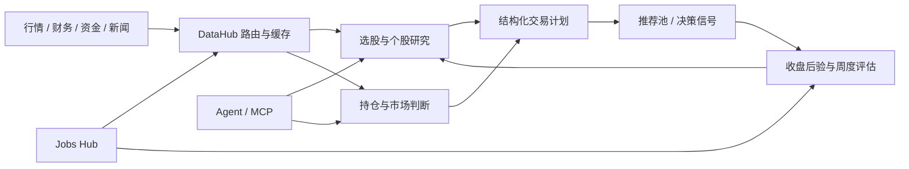

# shadow-foliant

面向 A 股个人投研的 Agent-first 系统。它把行情、选股、持仓、风险、策略回测和真实结果反馈整理成可调用的 MCP 工具，并用常驻任务完成盘前、盘中、盘后的自动化工作。Web 页面保留为观测和应急操作入口，不是主控制面。

项目不会自动替你做投资决策。所有分析结果都可能受数据延迟、接口降级、模型幻觉和样本偏差影响；交易前应再次核对价格、公告与账户状态。

## 它解决什么问题

- Agent 不需要逐个拼接底层接口：`agent_cockpit`、`research_stock`、`latest_selection` 提供高层聚合结果。
- 定时任务有明确依赖：盘后先预热 K 线，再做因子、指标和后验；依赖等待不占业务 worker。
- 手动重任务异步执行：提交后返回 `run_id`，由持久队列消费，进程重启后可以恢复。
- 选股保留完整 TOP15，同时再给最终 TOP5；最终层叠加多源共振、技术结构、追高风险、持仓与行业集中度约束。
- 决策不是只看一次输出：推荐和信号会记录真实后验，用胜率、平均收益、盈亏比和样本量反哺策略。
- 外部数据源失效时优先降级：统一数据层负责路由、缓存、熔断与兜底，结果会携带质量和限制说明。



## 主要能力

| 领域 | 能力 |
| --- | --- |
| Agent 控制面 | 运行总览、个股研究、选股产物、异步任务、任务状态、运行健康 |
| 选股 | 问财策略、妙想镜像、InStock 策略、多因子筛选、TOP15 汇总、最终 TOP5 |
| 技术与风险 | 多周期趋势、ATR、波动率、最大回撤、量价/OBV、ADX、唐奇安、形态、缠论、VaR |
| 组合 | 持仓盈亏、绩效、压力测试、五档买卖动作、交易计划、基金定投与估值 |
| 策略 | 参数化回测、基因组变异/组合、walk-forward 样本外上线门槛、部署集查询 |
| 反馈闭环 | 推荐跟踪、决策信号生命周期、真实收益回填、分来源/动作/周期评估 |
| 自动化 | 盘前策略、综合选股、盘中持仓、盘后缓存/因子/后验/回测、周度评估 |
| 辅助界面 | FastAPI + Vue SPA，用于状态查看、配置管理和手动操作 |

当前 MCP 服务暴露约 90 个工具。低层工具适合专项查询，高层工具更适合 Agent 日常管理。

## 快速开始

### 1. 安装

建议使用 Python 3.9 及以上版本和独立虚拟环境。

```bash
git clone <repository-url>
cd shadow-foliant
python3 -m venv venv
source venv/bin/activate
pip install -r requirements.txt
```

`mootdx` 和 TA-Lib 是可选能力，不在主依赖中。没有它们时会使用其他数据源或 pandas 兼容实现，不影响主程序启动。

### 2. 配置

```bash
cp .env.example .env
```

最小配置只需要填写一个可用的 OpenAI 兼容 LLM；不使用 AI 的行情和规则能力可以在没有 Key 的情况下运行。

```dotenv
DEEPSEEK_API_KEY=<your-llm-api-key>
DEEPSEEK_BASE_URL=<openai-compatible-base-url>
DEFAULT_MODEL_NAME=<model-name>

USE_POSTGRES=false
RAG_ENABLED=false
```

生产环境建议使用 PostgreSQL；Redis 是可选缓存，无法连接时会回退到进程内存和文件缓存。

| 配置 | 用途 | 是否必需 |
| --- | --- | --- |
| `DEEPSEEK_API_KEY` / 其他 Provider Key | 多智能体与 AI 研判 | AI 功能必需 |
| `DEEPSEEK_BASE_URL`、`DEFAULT_MODEL_NAME` | LLM 路由 | AI 功能必需 |
| `USE_POSTGRES`、`PG_*` | 生产数据库 | 推荐 |
| `REDIS_URL` 或 `REDIS_*` | 跨进程缓存与锁 | 可选 |
| `PROXY_URL` | 外部数据统一代理 | 可选 |
| `PYWENCAI_COOKIE` | 问财登录态增强 | 可选 |
| `EM_API_KEY` | 妙想第二意见 | 可选 |
| `QQ_WEBHOOK_URL` / 邮件 / Webhook | 通知 | 可选 |
| `PORTFOLIO_POSITION_MODE` | 高仓位保守买入门 | 可选 |
| `RAG_ENABLED` | 历史向量检索 | 默认关闭 |
| `WEBUI_ALLOWED_ORIGINS` | Web 跨源白名单 | 有跨域访问时配置 |

完整变量和注释见 [`.env.example`](.env.example)。`.env`、数据库、日志、Cookie、Token 和主机信息都不应提交到 Git。

### 3. 启动

Agent 主入口：

```bash
python mcp_server.py
```

定时任务常驻进程：

```bash
python -m jobs.jobs_hub --serve
```

Web 观测界面：

```bash
python webui/run_dev.py
# http://127.0.0.1:8601
```

Web 健康接口只检查本地数据库和手动队列，不会探测行情或调用 LLM：

```bash
curl http://127.0.0.1:8601/api/health
```

## 推荐的 Agent 工作方式

1. 先调用 `runtime_health`，确认运行版本、数据库和队列可用。
2. 调用 `agent_cockpit(compact=true)`，查看任务异常、选股快照、持仓、信号、策略部署集和数据源遥测。
3. 个股研究优先用 `research_stock(code, depth="quick", view="summary")`；只有确实需要更多上下文时才用 `deep/full`。
4. 看综合选股用 `latest_selection`，先读最终 TOP5，再按需回看完整 TOP15 和证伪信息。
5. 重任务用 `trigger_task` 提交，并复用同一个 `idempotency_key`；随后用 `task_run_status` 查询，不要在客户端长时间阻塞。
6. 修改监控、推荐或信号状态时先使用默认 `dry_run=true` 查看前后差异，确认后再执行。

手动任务队列会自动补齐已声明且当天未完成的上游任务。例如直接提交因子采集时，会先排入 K 线预热；上游失败时下游会明确标记为 `skipped`，不会静默产生半成品。

常用高层工具：

| 工具 | 适用场景 |
| --- | --- |
| `runtime_health` | 服务版本、数据库、队列与功能开关概况 |
| `agent_cockpit` | 每次接管项目时的第一屏 |
| `research_stock` | 带数据质量、市场结构和交易计划的个股研究 |
| `latest_selection` | 最近 TOP15 与最终 TOP5 选股产物 |
| `strategy_deployment` | 当前真正在线的基础、进化和组合策略 |
| `trigger_task` / `task_run_status` | 异步执行与追踪后台任务 |
| `datahub_health` | 外部数据源成功率、延迟、冷却和缓存命中 |
| `decision_signal_winrate` | 判断哪类信号在真实后验中有效 |

更完整的工具说明见 [AGENT_SKILL.md](AGENT_SKILL.md)。

## 自动任务节奏

下表只列主链，实际开关和依赖以 `jobs/automation_config.py` 为准，时间均为 Asia/Shanghai。

| 时间 | 主任务 | 说明 |
| --- | --- | --- |
| 08:55–09:30 | 基金盘前、晨间策略、选股预取与补取 | 准备盘前信息和选股缓存 |
| 09:45 | 综合选股 | 推送 TOP15，并生成最终 TOP5 |
| 10:05–12:00 | 早盘持仓、妙想复核、午间盯盘、午盘简报 | 盘中判断与重点候选跟踪 |
| 14:30 | 尾盘持仓总结 | 通知保持精简，完整结果留给 Agent 查询 |
| 16:30 起 | K 线预热 → 因子/指标/后验 | 下游按真实完成状态触发，不靠固定间隔猜测 |
| 17:00–19:00 | 收盘复盘、板块轮动、公告、回测与策略进化 | 重任务错峰执行 |
| 20:15–23:15 | 可选 RAG、基金刷新、当日盈亏、备份 | RAG 默认关闭；常规任务通常 23:10 前结束，周日清理约 23:15 收尾 |
| 周日 08:00 / 12:05 | 妙想前瞻 / 组合压力与持仓深析 | 高 token LLM 避开 09:00–12:00、14:00–18:00 |
| 周日 20:00–20:30 | 周回测和推荐评估 | 不调用 LLM，保留原时间 |

RAG 默认关闭，不参与日常摄取、分析和 Web 展示。需要实验时再显式设置 `RAG_ENABLED=true`。

## 数据可靠性与决策约束

- `data/datahub.py` 是外部数据统一入口，按健康度选择来源，并提供内存、Redis、文件三级缓存。
- 核心上下文缺失时，研究结果会标为 `partial` 或 `degraded`；交易计划默认收紧或转为观望。
- 历史胜率使用最小样本门槛和保守收缩，小样本高胜率不会直接放宽选股条件。
- 最终选股对已持仓股票和行业集中度使用软惩罚，在候选不足时仍允许回补，不会机械凑数或一票否决。
- `PORTFOLIO_POSITION_MODE=high` 时，自动买入遵循 fail-closed：缺少当天组合判断就不放行。
- 本项目主要产出分析、提醒和结构化计划；任何实盘下单仍应保留账户侧风控和人工确认。

## 项目结构

```text
shadow-foliant/
├── mcp_server.py          # Agent/MCP 入口
├── jobs/                  # 调度器、任务注册、持久手动队列
├── data/                  # DataHub 与原子数据源
├── analysis/              # 选股、技术、风险、回测、策略进化
├── portfolio/             # 持仓、绩效、盈亏和盘后总结
├── selection/             # 问财、妙想和规则选股
├── core/                  # 契约、LLM 路由、缓存、数据库、健康检查
├── webui/                 # FastAPI + Vue SPA
├── scripts/               # 部署、诊断、迁移和运维脚本
├── tests/                 # 无网络单元测试
└── docs/                  # 专题文档
```

架构细节见 [ARCHITECTURE.md](ARCHITECTURE.md)，使用说明见 [使用文档.md](使用文档.md)，当前运维交接见 [交接说明.md](交接说明.md)。

## 验证

项目测试默认不访问真实外部数据源：

```bash
PYTHONPYCACHEPREFIX=/tmp/shadow-foliant-pycache \
  python -m unittest discover -s tests -p 'test_*.py'

PYTHONPYCACHEPREFIX=/tmp/shadow-foliant-pycache \
  python -m compileall -q \
  core data agents analysis selection portfolio monitor notify jobs fund webui \
  mcp_server.py

bash -n scripts/deploy.sh scripts/configure_supervisor_logs.sh
```

## 生产部署

生产环境建议用 Supervisor 分别守护 `stock-jobs-hub` 和 `stock-webui`。一键部署脚本会：

1. 拒绝在错误分支或存在已跟踪改动时覆盖部署。
2. `git pull --ff-only`，并可校验指定提交。
3. 配置 Supervisor 日志轮转和历史归档。
4. 重启两个常驻服务。
5. 检查数据库、手动队列、Supervisor 状态和 Web 进程实际加载的提交版本。
6. 失败时输出两个服务的末尾诊断日志。

```bash
cd <project-directory>
EXPECTED_COMMIT=<commit-sha> bash scripts/deploy.sh
```

无代码更新时默认不重启；需要只重启服务可使用：

```bash
FORCE=1 bash scripts/deploy.sh
```

生产主机地址、SSH 用户、代理地址和仓库 Token 应保存在主机私有配置或密钥管理系统中，不写入 README、脚本参数默认值或 Git remote。

## 安全与隐私

- `.env`、`db/`、`logs/` 已从版本控制排除。
- Web 配置接口只允许白名单字段，密钥只返回“是否已设置”，不回显内容或尾号。
- 默认 CORS 只允许本机来源；不要把管理 API 直接暴露到公网。
- README 和示例只使用占位值。提交前仍应检查改动，避免把 Cookie、Token、Webhook、主机地址、持仓或成交数据带入文档和测试夹具。

## 免责声明

本项目仅用于研究、自动化和软件工程实践，不构成投资建议、收益承诺或交易指令。市场有风险，使用者应自行核实数据并承担决策结果。
